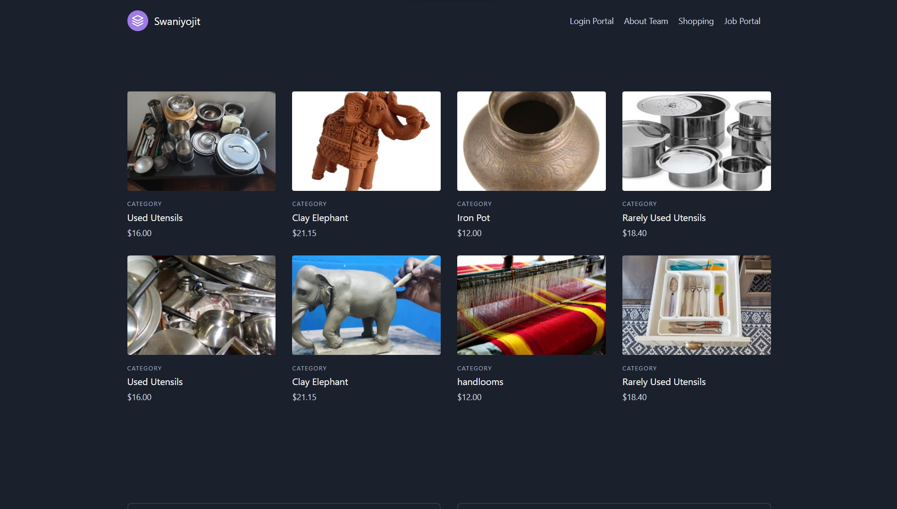
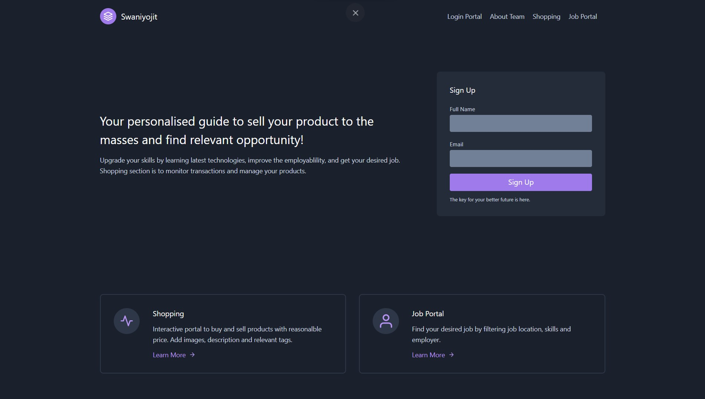
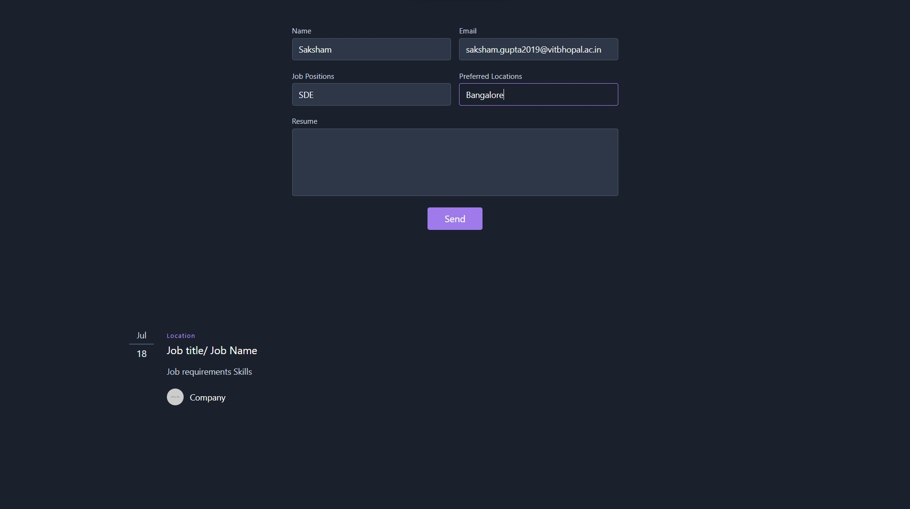
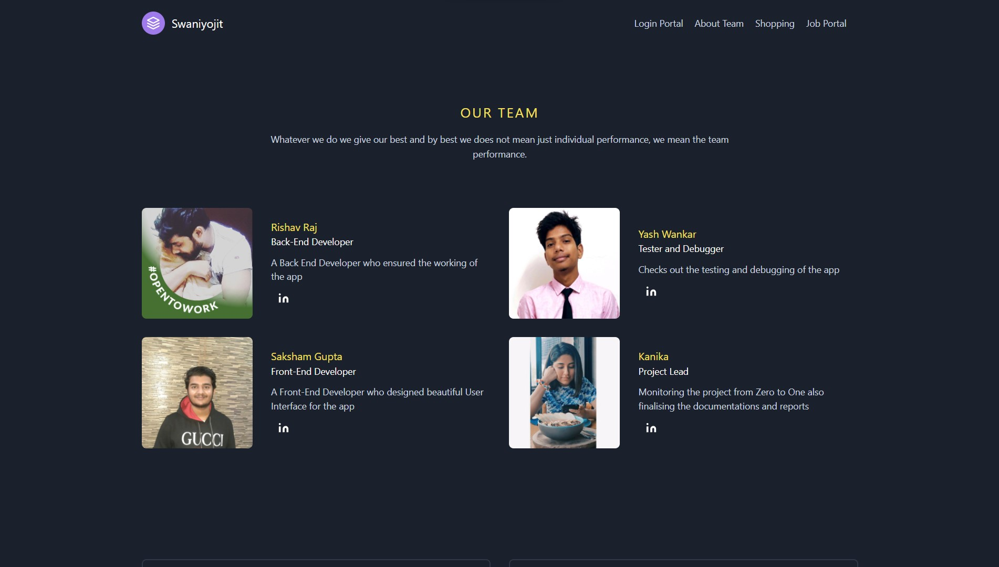

# Swaniyojit

A one-stop solution aimed at uplfiting lives of rural women with employment and welfare, helping them to become self-dependent and financially-stable.


## Overview

We will construct a totally useful internet site called " Swaniyojit ", intending to offer employment opportunities to all of the ladies across rural areas. We pay attention to each professional in addition to the unskilled sectors of employment. The internet site has 2 essential components. The first one is the Job Portal for ladies seeking out jobs withinside the professional or unskilled sectors. It offers a listing of jobs from diverse employers published in it, having separate login as a business enterprise or an applicant. Women can pick out the roles in keeping with their desire of abilities and location., and practice accordingly. The second Component is a buying-promoting platform for the family self-hired ladies inclined to promote their homemade gadgets like handicrafts, farm products, etc. The customer can purchase as a good deal as he/she wants, upload it to the cart and pay for it (which might assist them to aid their livelihoods). Lastly, we tend to offer a few assets and focus approximately authorities' schemes for rural ladies for her upliftment. We offer a one-forestall answer and manual for the agricultural ladies to come to be self-dependent subsequently rightly called " Swaniyojit ".
.


## Features

* The website provides a platform to sell the homemade items made my the rural women.
* Rural Women can upload their items and the details of it.
* Any user has the option of buying any item displayed to them.
* Any user can put any number of items in the shopping cart feature.
* The platform provides opportunities to the rural women who may be of skilled or unskilled alike.

## Technology Stack

### Web Technology

- Frontend
  - HTML
  - CSS
  - JavaScript
  - React.js
  
- Backend
  - Express.js
  - Node.js

- Database
  - MongoDB

- Tools
  - Git
  - Github

## Setup

Clone the following repository:
``` bash
git clone https://github.com/sgx-saksham/Swaniyojit.git
```
or download zip file from the Code button and extract in the files.

- Launch index.html with any browser window.

- Voila, explore and enjoy!

## Presentation

Find our project presentation [here](https://docs.google.com/presentation/d/1mJMthRVeARy55sE-66gC5RuXrYoP89XVGtBwn1DBe8s/edit?usp=sharing)

## Screenshots







## Our Team

* Rishav Raj
* Saksham Gupta
* Yash Wankar
* Kanika

### More power to women. Power Up!
